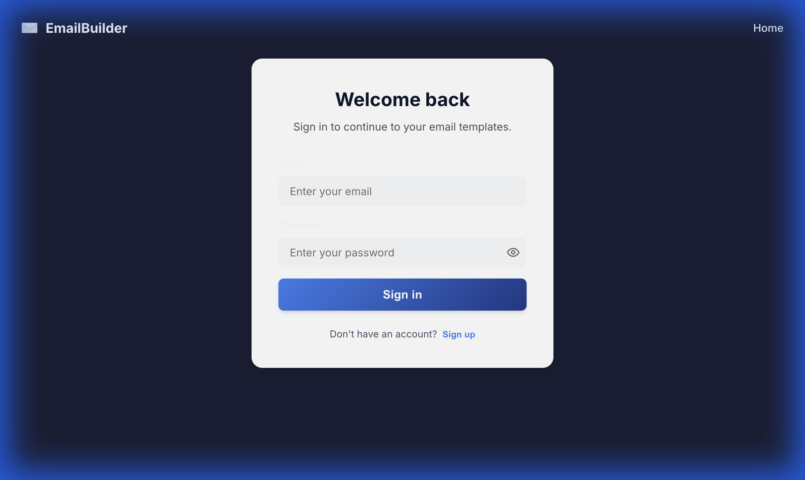
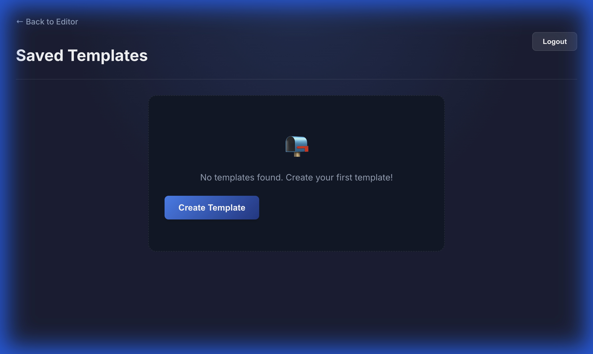
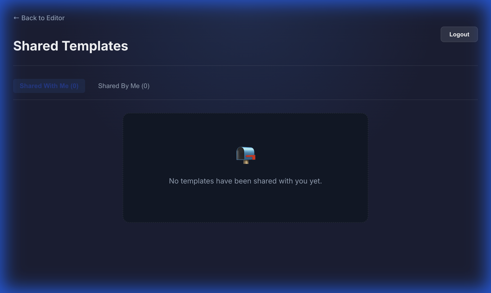
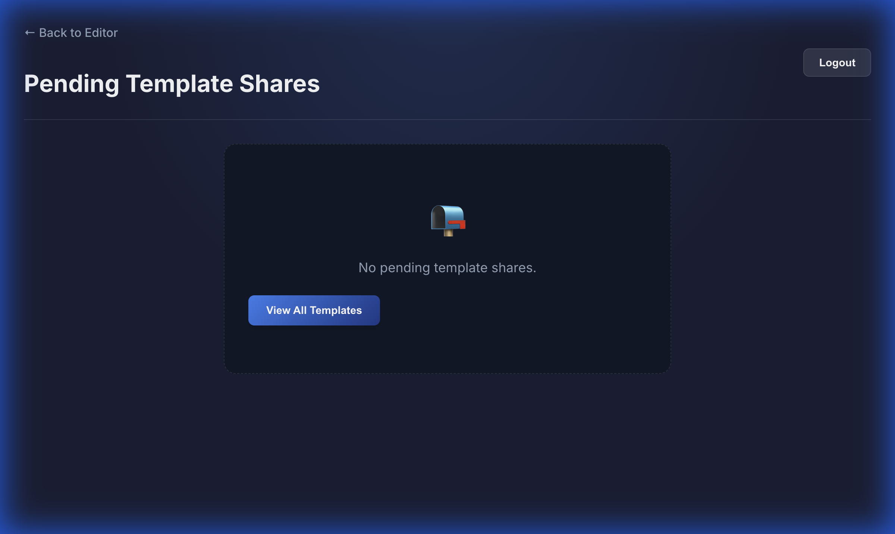

# 🚀 Templify — Email Template Builder

Templify is a powerful, intuitive platform for designing, editing, and managing professional email templates with zero coding required. Create dynamic content using drag-and-drop blocks, preview changes in real time, and export your templates in multiple formats for any workflow.

---

## ✨ Core Features

- **Live Preview** – Watch your email design update instantly while editing  
- **HTML Export** – Download production-ready HTML email templates  
- **JSON Export** – Export structured block data for programmatic workflows  
- **SPA Component Builder** – Generate reusable React components directly from your email layout  
- **Full Property Controls** – Customize fonts, colors, spacing, alignment, padding, and more  
- **Secure Authentication** – JWT-based login and registration system  
- **Template History** – Save, edit, and manage all your previous email templates  
- **Prebuilt Templates** – Start fast with professionally designed templates for common email use cases  
- **Copy to Clipboard** – Instantly copy formatted HTML for deployment or integration

---

## 📦 Block Library

Templify supports multiple drag-and-drop block types to build structured layouts:

1. **Text Block** – Rich text content with full typography controls  
2. **Image Block** – Add images using URLs with adjustable sizing and alignment  
3. **Button Block** – Customizable call-to-action buttons with target links  
4. **Divider Block** – Clean visual separators for layout structure  
5. **Spacer Block** – Adjustable whitespace to fine-tune design spacing

---

## 🎨 Advanced Customization

Each content block supports:

- Background color  
- Text color  
- Font size  
- Padding & spacing  
- Reordering (move up / move down)  
- Delete control  
- Live nested updates

---

## 🛠️ Setup & Installation

### ✔️ Prerequisites

Make sure you have installed:

- **Node.js** v18.0 or higher  
- **npm** v9.0 or higher  
- **MongoDB** (local installation or MongoDB Atlas cloud)

### Installation

1. Navigate to the project directory:
```bash
cd /Users/nidhisingh/Desktop/email-builder
```

2. Install frontend dependencies:
```bash
npm install
```

3. Navigate to the backend directory and install backend dependencies:
```bash
cd backend
npm install
```

4. Create a `.env` file in the backend directory with the following content:
```
PORT=5001
MONGODB_URI=mongodb://localhost:27017/emailbuilder
JWT_SECRET=email_builder_secret_key_12345
FRONTEND_URL=http://localhost:5173
```

5. Start MongoDB (if using local MongoDB):
```bash
mongod
```

6. Start the backend server:
```bash
cd backend
npm run dev
```

7. Start the frontend development server (in a new terminal):
```bash
npm run dev
```

8. Open your browser and navigate to:
```
http://localhost:5173/
```

## Usage

### Building Your Email Template

1. **Get Started**: Click "Get started" on the homepage
2. **Login/Signup**: Authenticate with your credentials
3. **Add Blocks**: Click on any block type in the left panel (Text, Image, Button, etc.)
4. **Edit Content**: Click on a block to select it and edit its properties in the right panel
5. **Customize Styling**:
   - Change background and text colors using color pickers
   - Adjust font size and padding with number inputs
   - Use the property panel for fine-tuned control
6. **Reorder Blocks**: Use the up/down arrows on hover to rearrange blocks
7. **Delete Blocks**: Use the X button on hover to remove blocks
8. **Save Template**: Click "Save Template" to store your work
9. **Template History**: Access all your saved templates from the history page

### Prebuilt Templates

1. Click "Prebuilt Templates" in the editor
#### HTML Export
1. Click the **Export** tab
2. Select **HTML** format
3. Click **Export as HTML**
4. Save the file and use it with email services

#### JSON Export
1. Click the **Export** tab
2. Select **JSON** format
3. Click **Export as JSON**
4. Use the JSON structure to rebuild templates programmatically

### SPA Builder

1. Click the **SPA** tab to view generated React component code
2. Download the generated files:
   - `EmailTemplate.jsx` - The email component
   - `App.jsx` - Main application component
   - `App.css` - Styling

### Copy to Clipboard

1. Click "Copy HTML" to copy the email HTML to your clipboard
2. Paste the HTML anywhere you need it

## Project Structure

```
email-builder/
├── src/
│   ├── components/
│   │   ├── BlockPalette.jsx      # Block selection panel
│   │   ├── Canvas.jsx             # Main editing canvas
│   │   ├── BlockRenderer.jsx       # Renders individual blocks
│   │   ├── PreviewPane.jsx         # Preview view
│   │   ├── ExportPane.jsx          # Export functionality
│   │   └── SPABuilder.jsx          # React component generator
│   ├── pages/
│   │   ├── HeroPage.jsx           # Landing page
│   │   ├── AuthPage.jsx           # Login/Signup page
│   │   └── TemplateHistory.jsx    # Template history page
├── package.json
└── README.md
```

## Component Details

### BlockPalette
Displays available block types. Clicking a button adds a new block.

### Canvas
Main editing area. Click to select, hover to access controls:
- **Delete (✕)**: Remove the block
- **Move Up (↑)**: Move block up
- **Move Down (↓)**: Move block down

### PropertyPanel
Context-sensitive editor for the selected block.

### PreviewPane
Live preview of the email template.

### ExportPane
Export in HTML or JSON formats.

### SPABuilder
Generate React component code from the template.

## Backend API

### Authentication
- `POST /api/auth/register` - Register a new user
- `POST /api/auth/login` - Login user
- `GET /api/auth/profile` - Get user profile (protected)

### Templates
- `POST /api/templates` - Create a new template (protected)
- `GET /api/templates` - Get all user templates (protected)
- `GET /api/templates/:id` - Get a specific template (protected)
- `PUT /api/templates/:id` - Update a template (protected)
- `DELETE /api/templates/:id` - Delete a template (protected)
- `POST /api/templates/:id/send` - Send template as email (protected)

### Prebuilt Templates
- `GET /api/prebuilt` - Get all prebuilt templates (protected)
- `GET /api/prebuilt/:id` - Get a specific prebuilt template (protected)

## Development

### Build for Production
```bash
npm run build
```

### Preview Production Build
```bash
npm run preview
```

## Browser Support

- Chrome/Edge (latest)
- Firefox (latest)
- Safari (latest)
- Mobile browsers

## Email Functionality

The application includes built-in email sending capability using Nodemailer. For detailed configuration and usage instructions, see [EMAIL_FUNCTIONALITY.md](EMAIL_FUNCTIONALITY.md).

## Tips & Best Practices

1. Test exported HTML emails in multiple email clients
2. Use absolute URLs for images
3. Stick to web-safe colors
4. Keep layouts simple for mobile rendering
5. Use the Preview pane frequently

---

Built with ❤️ using React + Vite + Node.js + Express + MongoDB

## Frontend Flow & Navigation Guide

This section outlines the user flow through the Email Builder application, detailing each page and the functionality of key buttons.

### 1. Hero Page (Landing Page)
**Route:** `/`


The landing page introduces the application.

*   **Get Started**: Navigates to the Authentication page (`/auth`).

### 2. Authentication Page
**Route:** `/auth`



Allows users to sign in or register.

*   **Sign In / Sign Up Toggle**: Switches between the login and registration forms.
*   **Email & Password Fields**: Input credentials.
*   **Submit Button (Login/Create Account)**: Authenticates the user and redirects to the Dashboard (`/app`).

### 3. Dashboard (Editor)
**Route:** `/app`


The main workspace for building email templates.

*   **Header Navigation**:
    *   **Saved**: Navigates to the Saved Templates page (`/saved`).
    *   **Shared**: Navigates to the Shared Templates page (`/shared-templates`).
*   **Toolbar**:
    *   **Prebuilt Templates**: Opens a modal to select from pre-made templates.
    *   **Clear Canvas**: Resets the current workspace.
    *   **Copy HTML**: Copies the generated HTML code to the clipboard.
    *   **Save Template**: Saves the current design to the database.
    *   **Logout**: Logs the user out and redirects to the Auth page.
*   **Editor Tabs**:
    *   **Editor**: The drag-and-drop builder view.
    *   **Preview**: Shows how the email will look.
    *   **Export**: Options to export the template.
    *   **SPA**: Single Page Application builder view.

### 4. Saved Templates
**Route:** `/saved`



Displays a list of templates saved by the user.

*   **Edit**: Loads the selected template into the Editor.
*   **Delete**: Removes the template.
*   **Share**: Opens options to share the template with other users.

### 5. Shared Templates
**Route:** `/shared-templates`



Shows templates that have been shared with the user or by the user.

*   **Shared With Me**: Tab showing incoming templates.
*   **Shared By Me**: Tab showing outgoing templates.
*   **Use Template**: Loads a shared template into the Editor (creates a copy).

### 6. Pending Shares
**Route:** `/pending-shares`



Manages incoming share requests that require acceptance.

*   **Accept**: Adds the shared template to your collection.
*   **Decline**: Rejects the share request.
