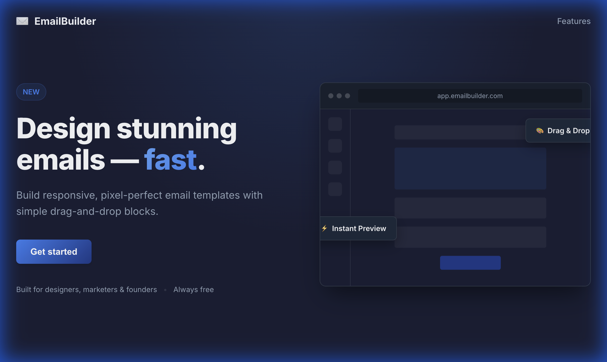
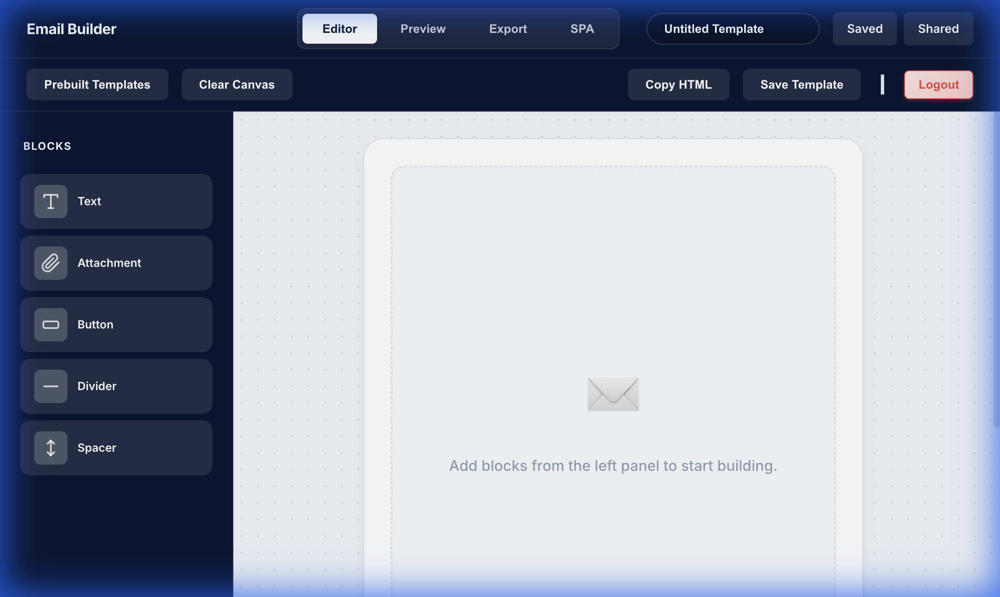

# Frontend Flow & Navigation Guide

This document outlines the user flow through the Email Builder application, detailing each page and the functionality of key buttons.

## 1. Hero Page (Landing Page)
**Route:** `/`

The landing page introduces the application.

*   **Get Started**: Navigates to the Authentication page (`/auth`).

## 2. Authentication Page
**Route:** `/auth`

Allows users to sign in or register.

*   **Sign In / Sign Up Toggle**: Switches between the login and registration forms.
*   **Email & Password Fields**: Input credentials.
*   **Submit Button (Login/Create Account)**: Authenticates the user and redirects to the Dashboard (`/app`).

## 3. Dashboard (Editor)
**Route:** `/app`

The main workspace for building email templates.

*   **Header Navigation**:
    *   **Saved**: Navigates to the Saved Templates page (`/saved`).
    *   **Shared**: Navigates to the Shared Templates page (`/shared-templates`).
*   **Toolbar**:
    *   **Prebuilt Templates**: Opens a modal to select from pre-made templates.
    *   **Clear Canvas**: Resets the current workspace.
    *   **Copy HTML**: Copies the generated HTML code to the clipboard.
    *   **Save Template**: Saves the current design to the database.
    *   **Logout**: Logs the user out and redirects to the Auth page.
*   **Editor Tabs**:
    *   **Editor**: The drag-and-drop builder view.
    *   **Preview**: Shows how the email will look.
    *   **Export**: Options to export the template.
    *   **SPA**: Single Page Application builder view.

## 4. Saved Templates
**Route:** `/saved`

Displays a list of templates saved by the user.

*   **Edit**: Loads the selected template into the Editor.
*   **Delete**: Removes the template.
*   **Share**: Opens options to share the template with other users.

## 5. Shared Templates
**Route:** `/shared-templates`

Shows templates that have been shared with the user or by the user.

*   **Shared With Me**: Tab showing incoming templates.
*   **Shared By Me**: Tab showing outgoing templates.
*   **Use Template**: Loads a shared template into the Editor (creates a copy).

## 6. Pending Shares
**Route:** `/pending-shares`

Manages incoming share requests that require acceptance.

*   **Accept**: Adds the shared template to your collection.
*   **Decline**: Rejects the share request.
